# Installation d'une VM 
---

**Quest-ce qu'une VM (machine virtuelle) ?**

C'est un environnement virtualisé qui fonctionne sur une machine physique. Elle permet d'émuler un OS (Windows, Linux, Mac, etc..) sans l'installer physiquement sur l'ordinateur.

### Installation de la VM Linux (Debian 11)

Dans un premier je sélectionne l'iso qui va permettre à la vm d'émuler l'OS concerné, ici ce sera **debian 11**, une des nombreuses distributions Linux.

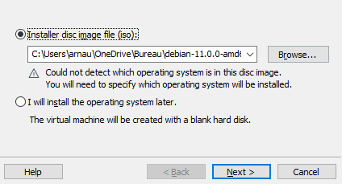

Je sélectionne ensuite l'OS approprié ...

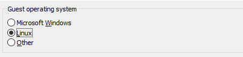

J'attribue ensuite un nom à cette machine virtuelle ainsi qu'un chemin d'accès, je peux également définir la taille maximum que peux prendre la VM sur le disque, par défault elle sera de **20GB**.

---

Après avoir lancé la VM pour la première fois cette interface apparait (ci-dessous 👇), on ira sur "**Install**" pour lancer le processus d'installation de debian.

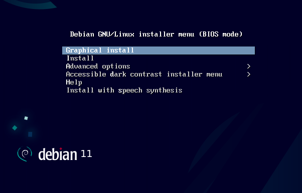

Après ceci il nous sera demandé de choisir un language pour le système de l'OS ainsi que notre situation géographique (Pays) et pour finir la langue que nous utiliseront couramment à travers les interfaces de l'OS et les applications en général.

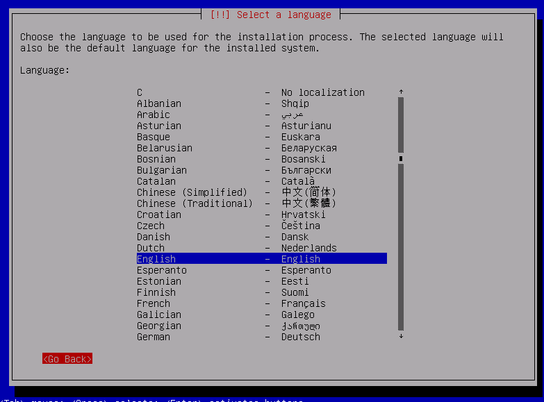

Prochaine étape il sera demandé de configurer le réseau en donnant un nom à la machine.

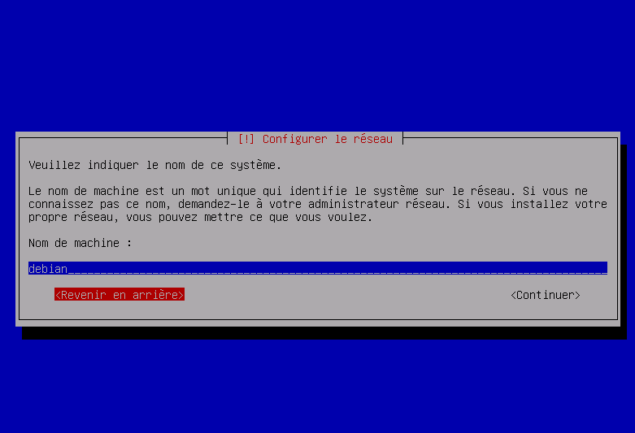

Il nous sera ensuite demandé de fournir un mot de passe de superutilisateur (<<**ROOT**>>). *Cet utilisateur est l'utilisateur qui a les droits d'accès administratifs au système.*

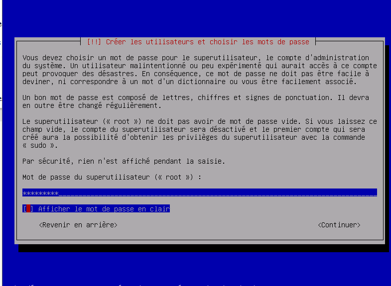

Ensuite il est demandé de choisir la méthode de partionnement des disques. Cela consiste à créer des zones sur le disque dont les données ne seront pas mélangées. Ici on sélectionnera la première proposition.

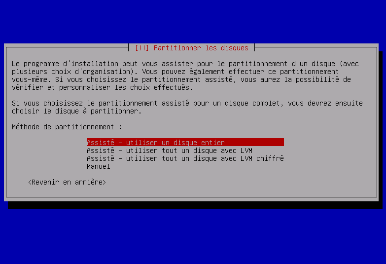

On va ensuite sélectionner le miroir de l'archive Debian, ce qui va nous permettre d'installer Debian par le réseau pour mettre à jour des systèmes déjà installés par exemple. Ici on sélectionnera **deb.debian.org**.

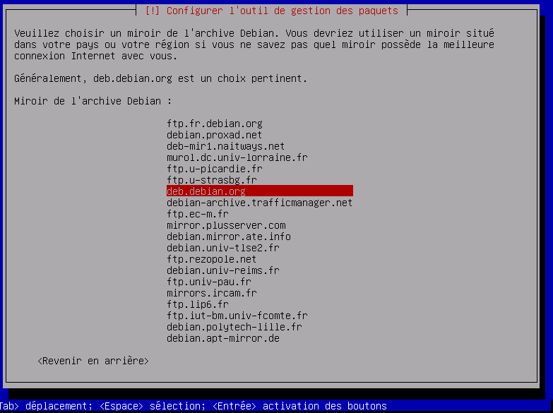

Prochaine étape il est question de configurer l'outil de gestion des paquets en fournissant un mandataire HTTP c'est à dire un serveur proxy mais dans ce cas là ce ne sera pas nécessaire pour la suite de l'exercice.

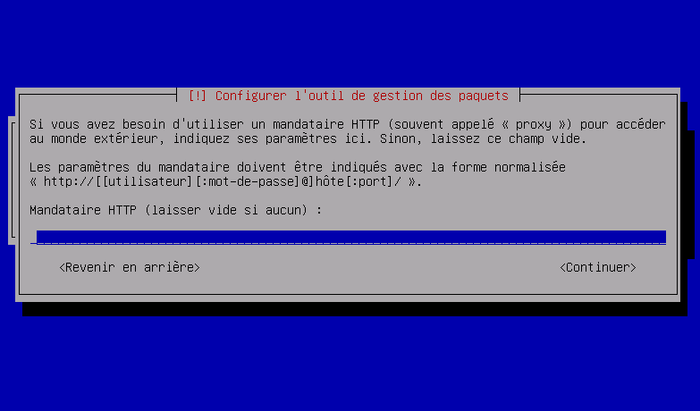

Il faut ensuite sélectionner les logiciels pré-installés sur Debian. Ici on ne sélectionnera les utilitaires usuels au système.

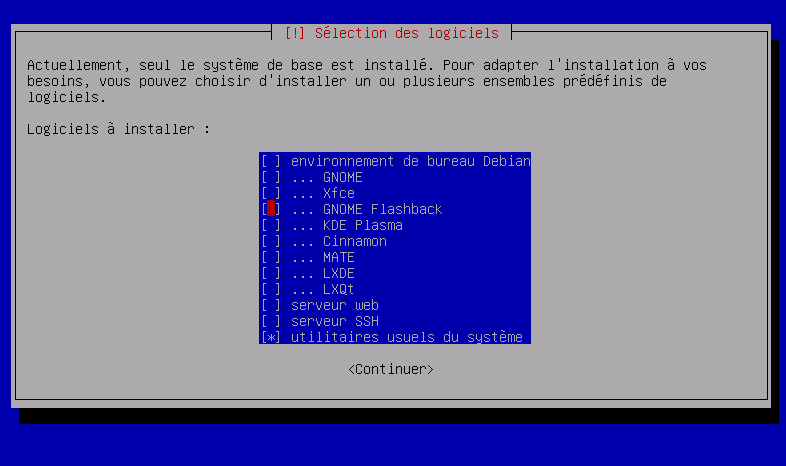

On va ensuite installer le programme de démarrage **GRUB** dans le répertoire **/dev/sda**, le programme GRUB est un programme d'amorçage de micro-ordinateur.

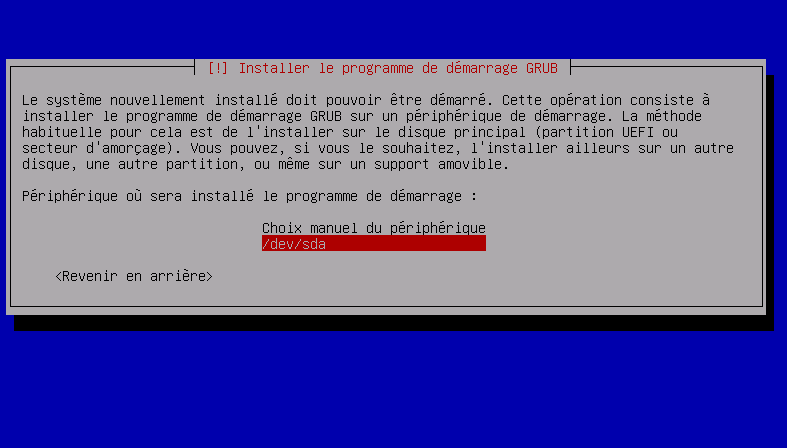

Après quelques chargements l'installation est enfin terminée

Debian démarre et je dois rentrer mes identifiants (login et mdp) pour accéder au terminal et pouvoir utiliser les commandes comme bon me semble.

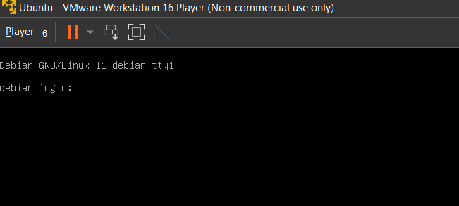

Je peux désormais accéder au terminal passer en root, ou rentrer n'importe qu'elle commande.

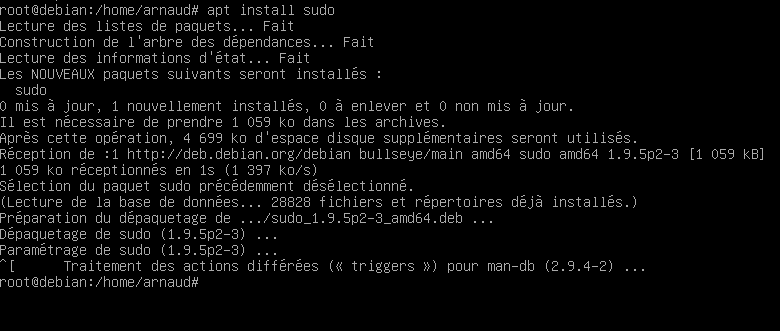

--- 

[I - 2 | page suivante ](https://github.com/Anescoo/Linux-B2-TP1/blob/main/ETAPE2.md) >