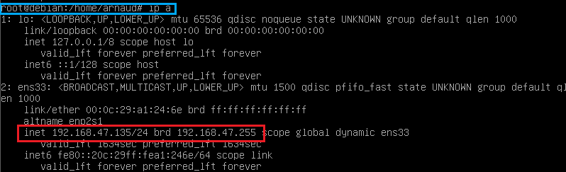
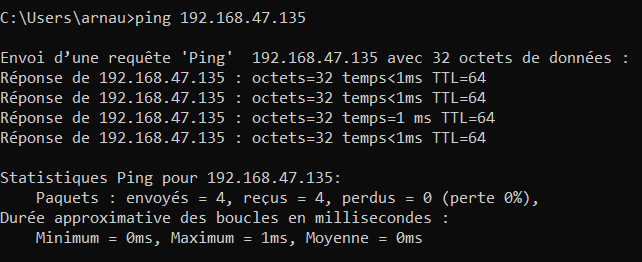

# Mise en place d'une connexion par SSH
---

**Quest-ce qu'une clé SSH ?**

Une clé **Secure Shell** (SSH) permet de créer une connexion sécurisée sur un réseau non-sécurisé.

### Connexion entre le poste Windows et la VM

Tout d'abord il faut vérifié que chaque OS (poste et VM) soit en soit configuré en DHCP pour récupérer automatiquement une adresse IP.

Une fois ceci fait je vais faire un ping sur ma VM depuis le terminal de mon poste Windows. Grâce à l'IP de ma VM (en rouge) que j'aurais récupéré depuis son terminal avec la commande 

```
ip a
```

(en bleu). L'IP de ma VM est donc 

```
192.168.47.135
```



Le ping à correctement fonctionné.



Pour générer une connexion il faut tout d'abord installer **sudo** dans la VM Debian avec la commande suivante : 

```
apt install sudo
```

Il faut ensuite installer un server SSH sur sa VM avec la commande suivante : 

```
sudo apt install openssh-server
```

Dernière étape il faut rentrer dans le terminal de son poste la commande suivante : ssh __(*nom d'utilisateur de la VM*)@(*l'ip de la VM*)__ 

```
ssh arnaud@192.168.47.135
```

La connexion est réussite il est donc maintenant possible d'utiliser sa machine virutelle **Debian 11** depuis son invite de commande.

---

[II - 1 | page suivante ](https://github.com/Anescoo/Linux-B2-TP1/blob/main/ETAPE3.md) >


