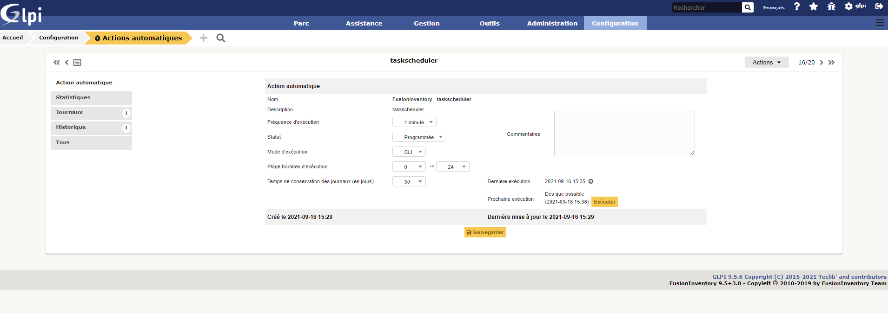
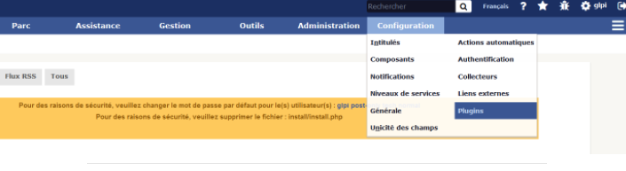

# Installation de Fusion Inventory
---

**C'est quoi Fusion Inventory ?**

Fusion Inventory est un logiciel servant à l'inventaire et la maintenance d'un parc informatique à l'aide d'autres logiciels de ce type tels que GLPI. Il permet d'effectuer l'inventaire matériel et logiciel.

Tout d'abord :

#### Comment résoudre le problème de la crontab ?

Effectivement il y a un message d'alerte du cron de GLPI. Il est dû à une absende de **cron.php** du GLPI dans le cron de Linux.


Pour résoudre ce problème, marquez ces commandes dans votre terminal **debian 11** :
```# crontab -u www-data -e```

*il faut sélectionner le choix numéro **1***

- Un fichier s'ouvre à la fin de celui ci il faut ajouter la ligne suivante : ```*/1 * * * * /usr/bin/php5 /var/www/html/glpi/front/cron.php &>/dev/null```

- Une fois cela finis on relance le daemon du cron :
```# /etc/init.d/cron restart```

- Il faut ensuite aller dans **Configuration** → **Actions Automatiques**, puis aller à la deuxième page et chercher l'action "**tasksheduler**.


- Après avoir cliquer dessus on clique sur le bouton "**Executer**" :


Suite à cette manipulation le message ne devrait plus s'afficher.

---

## Installez et configurez de Fusion Inventory

- Tout d'abord il faut mettre à jour le système avec :
```# apt-get update && apt-get upgrade```

- Ensuite on retourne dans le répertoire des sources et on télécharge le plugin **Fusion Inventory** avec un lien :
```# cd /usr/src```
```wget https://github.com/fusioninventory/fusioninventory-for-glpi/releases/download/glpi9.5%2B3.0/fusioninventory-9.5+3.0.tar.bz2``` (on va télécharger le plugin grâce la commande **wget** avec le lien )
```tar xfvj fusioninventory-9.5+3.0.tar.bz2 -C /var/www/html/glpi/plugins``` (on va extraire les données du téléchargement pour les transférer dans le dossier plugins en suivant ce chemin)

- On va ensuite attribuer les droits d'accès au serveur web :
```# chown -R www-data /var/www/html/glpi/plugins```

- Ensuite il n'y a plus qu'a finaliser l'installation sur l'interface web, tout d'abord il faut se reconnecter à **glpi**:


- Une fois connecté, on va dans la rubrique suivante : **Configuration** → **Plugins** :


- Prochaine étape on devrait voir apparaitre la fenêtre suivante, il suffira de cliquer sur "**Installer**" le plugin depuis la ligne correspondante et ensuite l'activer avec le "verrou" rouge qui passera au vert : 


- Voici ce que cela donne au final, félicitation **Fusion Inventory** est installé et prêt à l'emploie :


