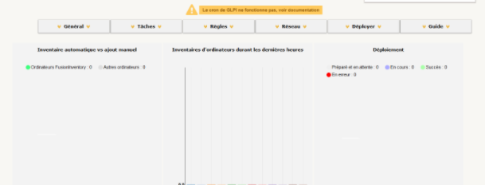
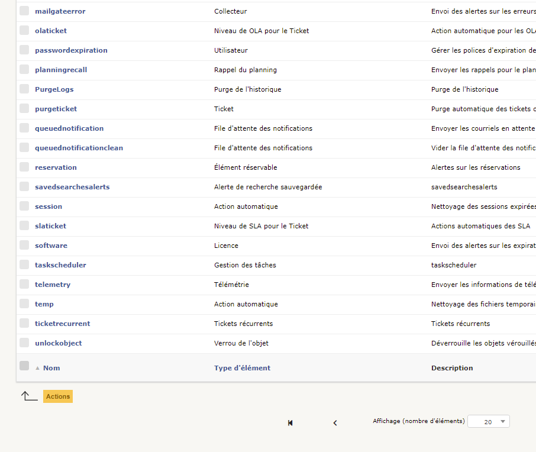
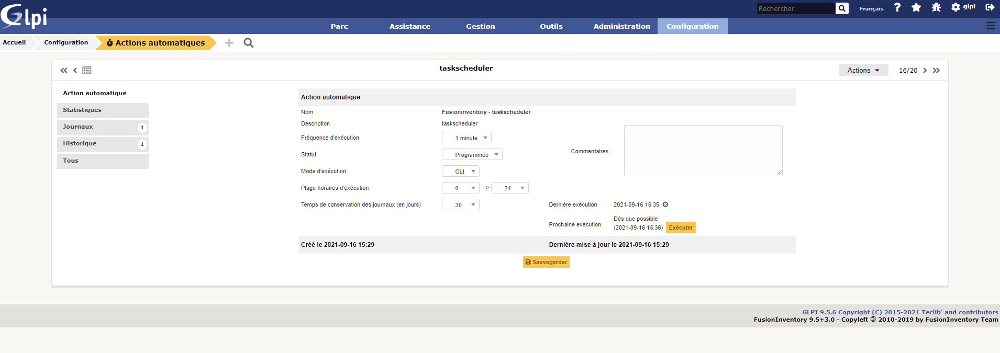

## Comment résoudre le problème de la crontab ?

Effectivement il y a un message d'alerte du cron de GLPI. Il est dû à une absende de **cron.php** du GLPI dans le cron de Linux.



Pour résoudre ce problème, marquez ces commandes dans votre terminal **debian 11** :

```
crontab -u www-data -e
```

*il faut sélectionner le choix numéro **1***

- Un fichier s'ouvre à la fin de celui ci il faut ajouter la ligne suivante : 

```
*/1 * * * * /usr/bin/php5 /var/www/html/glpi/front/cron.php &>/dev/null
```

- Une fois cela finis on relance le daemon du cron :
  
```
/etc/init.d/cron restart
```

- Il faut ensuite aller dans **Configuration** → **Actions Automatiques**, puis aller à la deuxième page et chercher l'action "**tasksheduler**.



- Après avoir cliquer dessus on clique sur le bouton "**Executer**" :


Suite à cette manipulation le message ne devrait plus s'afficher.

---

[III - 2 | page suivante ](https://github.com/Anescoo/Linux-B2-TP1/blob/main/ETAPE4.md) >