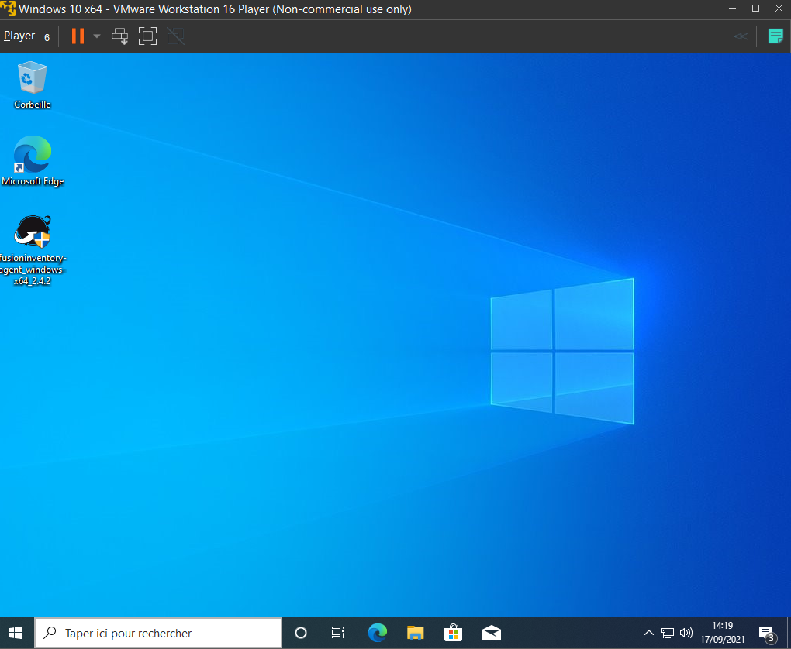

# Mise en place d'un poste Windows 10
---

#### Installation d'une VM Windows Server

- Dans un premier temps je sélectionne l'iso en question, ici ce sera celui-ci :

- On saisit ensuite un nom d'utilisateur avec mot de passe. Il n'est pas obligatoire de saisir des clés **windows 10**.

- Après configuration de l'installation, cette dernière s'initialise automatiquement en téléchargeant tous les fichiers ,logiciels et les mises à jour de **Windows 10**

- L'accès a l'interface de connexion Windows charge...

- Nous avons désormais accès à notre poste Windows 10, l'installation de la machine virtuelle s'avère réussite.

---

[IV - 2 | page suivante](https://github.com/Anescoo/Linux-B2-TP1/blob/main/ETAPE7.md) >

