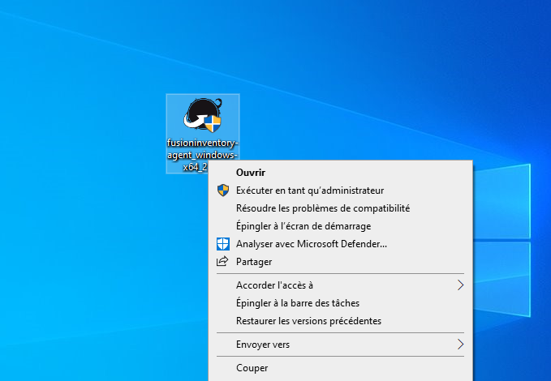
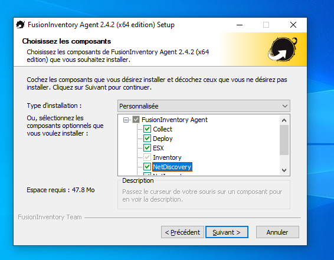
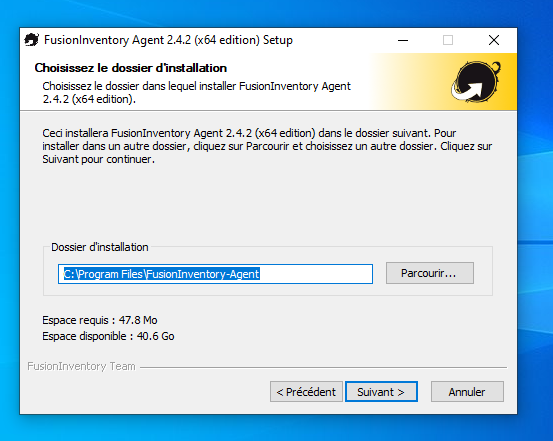
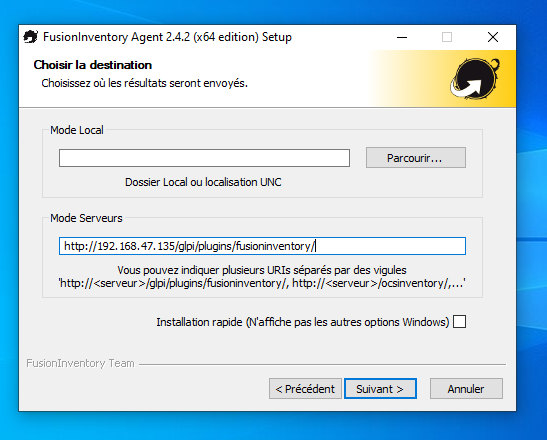
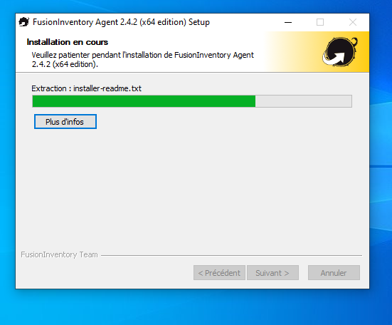
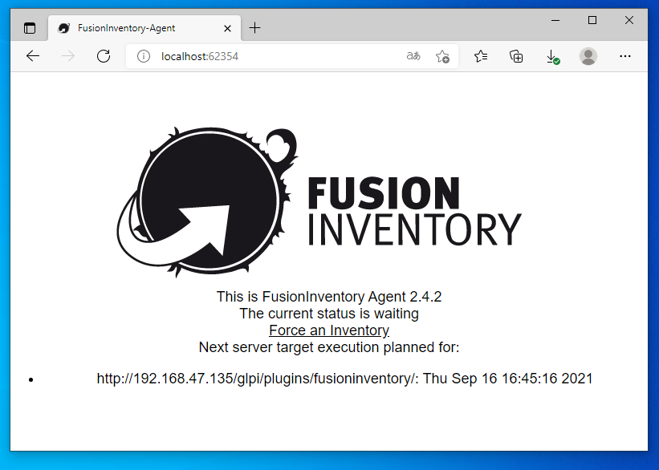
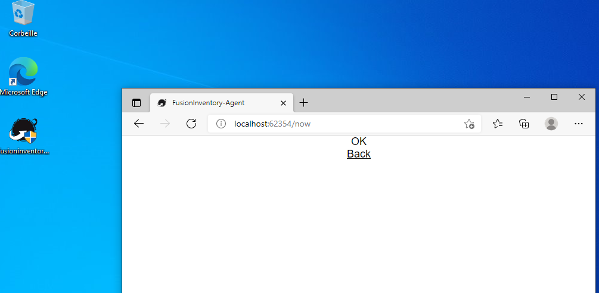
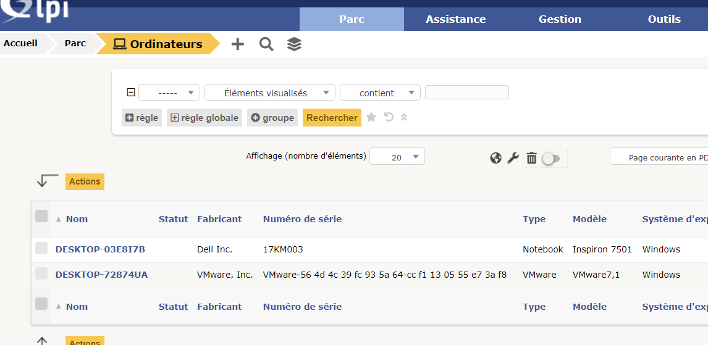

# Remonté d'un poste Windows 10 dans l'inventaire GLPI
---


---

#### Installation de Fusion Inventory Agent

- Tout d'abord rendez-vous sur la machine virtuelle **windows 10** que vous avez précédemment installé :


- Ensuite aller sur navigateur internet : google, mozilla, internet explorer, etc... Ici ce sera **Microsoft Edge** et télécharger le logiciel **Fusion Inventory Agent**.



- On va d'abord configurer l'application.



- On va définir un chemin d'installation :



- On va ensuite aller chercher le lien d'accès à fusion inventory dans GLPI :

```
http://192.168.47.135/glpi/plugins/fusioninventory/
```



- Après la configuration l'installation s'initialise :



- Il faut ensuite aller sur le navigateur et saisir :

```
localhost:62354
```

et cliquer sur **Force an Inventory**



- On peut remarquer que la manipulation a fonctionné :



- Direction **GLPI**. Aller dans le menu **Parc** → **Ordinateurs**, cette interface devrait apparaitre :



- On peut voir sur la deuxième ligne le nom de ma machine **DESKTOP-72874UA**, le fabricant est **Vmware** (logiciel pour machine virtuelle), et le système d'exploitation est **Windows**
- La remontée du poste Windows 10 dans l'inventaire GLPI grâce à la manipulation sur la VM Windows avec **Fusion Inventory Agent** à effectivement été concluante.